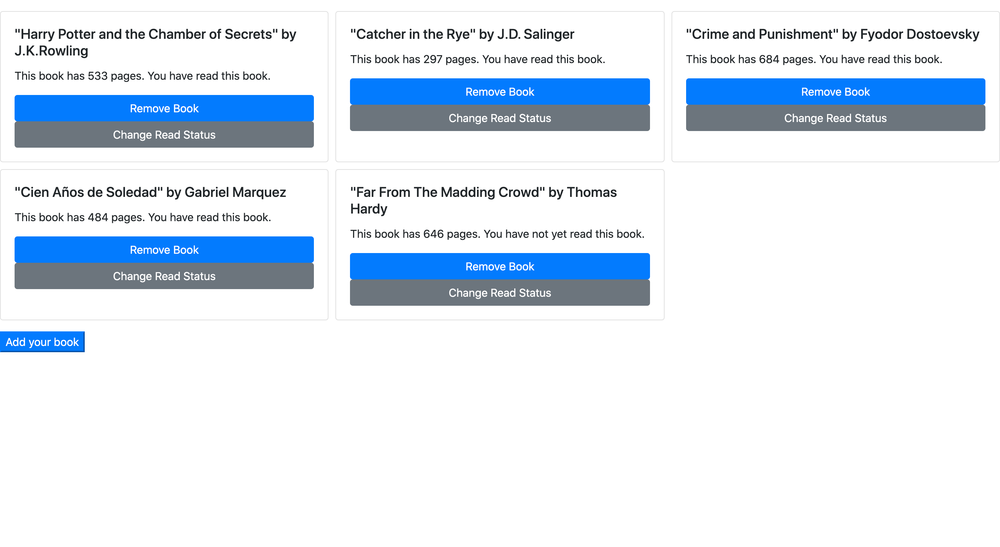

# Library

> "Library" was built as part of Microverse's JavaScript module. It demonstrates the use of JS for manipulating the Document-Object Model. The main aim of this project was to practice writing modular code, using constructors and setting up a simple JS project.

In this project, a user may view information about books in their "Library". They may also open and complete a form to add new books they've read, or remove and update the 'read' status of existing books.

## Built With

- JavaScript
- HTML & CSS
- Bootstrap

## Live Demo

**Want to check out our work for yourself? Take a look at the [Live Demo](https://raw.githack.com/Joseph-Burke/Library/feature/working_branch/index.html).**

### Setup

To access this project locally, follow these steps:

1. Open a Terminal and navigate to the location in your system where you would like to download the project. **New to Terminal? [Learn here](https://www.freecodecamp.org/news/conquering-the-command-line-f85f5e46c07c/).**

2. Enter the following line of code to clone this repository:

`git clone git@github.com:Joseph-Burke/Library.git`

3. Enter the following line of code to move inside the downloaded repo:

`cd Library`

**Congratulations!** Library is all set up! You can now open the `index.html` file using a browser of your choosing.

## Authors

👤 **Joseph Burke**

- Github: [@Joseph-Burke](https://github.com/Joseph-Burke)
- Twitter: [@__joeburke](https://twitter.com/__joeburke)
- LinkedIn: [Joseph Burke](https://www.linkedin.com/in/joseph-burke-b7a8261a5)

👤 **Esteban Pinczinger**

- Github: [@epinczinger](https://github.com/epinczinger)
- Twitter: [@epinczinger](https://twitter.com/epinczinger)
- LinkedIn: [Esteban Pinczinger](https://www.linkedin.com/in/esteban-pinczinger)

## 🤝 Contributing

Contributions, issues and feature requests are always welcome!

Feel free to check the [issues page](issues/), or send us a message on social media if you have any comments or feedback on the project.

## Show your support

If you've read this far, give us a star! ⭐️ 

## Acknowledgments

- Thanks to our peers and colleagues at Microverse.
- Thanks to the Odin Project for their free-to-use learning materials!

## 📝 License

This project is [MIT](lic.url) licensed.
